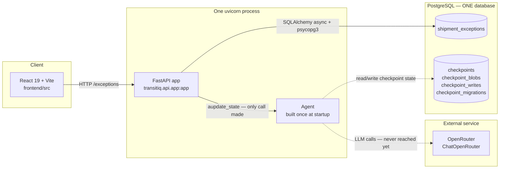

# 01 — System context

**The question this answers:** what are the moving parts, and what does the
running process talk to?

Dashed arrows are built-but-not-exercised. Solid arrows run today.

## How to read it

**One process, two jobs.** `uvicorn` starts a single FastAPI process. During its
startup it does three things in order: creates any missing tables, opens the
checkpointer and runs its migrations, then builds the agent and stores it on
`app.state.agent`. The agent is not created per-request — it is built once and
reused.

**One database, two tenants.** There is a single PostgreSQL database holding both
your application table (`shipment_exceptions`) and the four tables LangGraph's
checkpointer owns. Nothing separates them at the database level. This is why page
04 draws them together, and why cleaning up a shipment does not clean up its
checkpoint rows.

**Two outbound dependencies.** Postgres (via SQLAlchemy for your data, via
`AsyncPostgresSaver` for agent state) and OpenRouter for the model. Everything
else is internal.

**Where the traffic door is.** In development, Vite proxies only `/exceptions` to
the API — so `/health` is *not* reachable through the dev server, only by hitting
`127.0.0.1:8765` directly. In production, FastAPI mounts the built UI at `/` itself.

## Follow it in the code

| What | Where |
|---|---|
| App assembly, lifespan, static mount | `src/transitiq/api/app.py` |
| Agent construction at startup | `src/transitiq/api/app.py:24` → `workflow/agent.py:59` |
| Postgres connection details | `src/transitiq/database/db.py:9-25` |
| The model choice | `src/transitiq/llm/openrouter_service.py:6` |
| Dev proxy (and what it skips) | `frontend/vite.config.ts` |
| Server host/port | `src/transitiq/api/run.py:14-17` |

## Gotchas

- **The model id is hardcoded** at `llm/openrouter_service.py:6`
  (`inclusionai/ling-3.0-flash-fin:free`), not read from the environment. Changing
  models means editing code.
- **`run.py` forces a selector event loop** on Windows because psycopg's async
  connections need one. That is a real platform constraint, not a stylistic choice.
- **The UI mount is conditional** — `if UI_DIST.is_dir()` in `app.py:37`. If you
  never ran `npm run build`, there is no `frontend/dist/`, and the app silently
  serves the API only. This is why the API can be exercised with no frontend present.
- **The agent lives on `app.state`**, so routes reach it via `request.app.state.agent`.
  That is the seam any future agent endpoint would use.