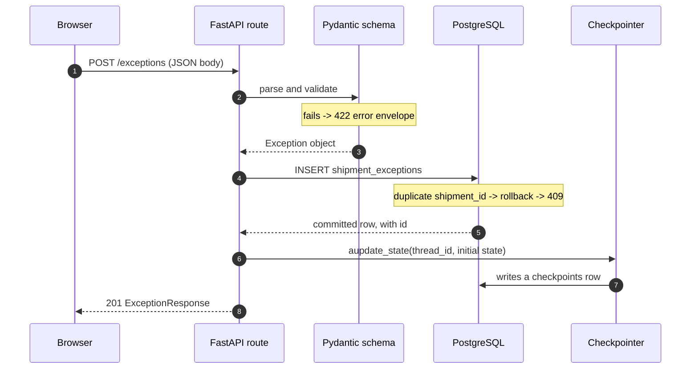
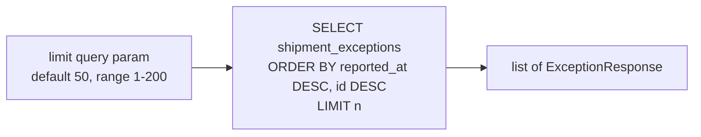

# 02 — Request flow

**The question this answers:** what happens, in order, when a shipment exception
is recorded?

## Recording an exception — `POST /exceptions`



## How to read it

Walk it top to bottom — this is the order the code runs.

**Steps 1–2: validation happens before anything touches the database.** Pydantic
checks `source` is one of exactly four literals and that `raw_text` has at least
one character. A bad body never reaches the database.

**Steps 3–5: the write, and the one interesting failure.** The insert is committed
inside a `try`. If `shipment_id` already exists — it is a `unique` column — Postgres
raises `IntegrityError`, the session is rolled back, and the caller gets a **409**
with a readable message. This is the only place in the app where a database
constraint is translated into a specific HTTP status. Note the order: rollback
first, *then* raise, so the session is never left dirty.

**Step 6: the state seed — and the end of the line.** After the row is committed,
the route calls `aupdate_state` to write an initial state into the LangGraph
checkpoint under `thread_id = "shipment:{shipment_id}"`. This is the *only* agent
call in the entire codebase. The route then returns. **Nothing analyses the
exception.**

### The gap, stated plainly

```
   ┌──────────────────────────────────────────────────────────────┐
   │  agent.ainvoke(...)   <-- DOES NOT EXIST ANYWHERE YET        │
   └──────────────────────────────────────────────────────────────┘
```

The agent is fully assembled at startup, its state is seeded correctly, and eight
tools are registered against it. No code path invokes it. So today the system
records exceptions and prepares them for analysis, but never performs it. Page 03
describes what *would* run the moment that call is added.

### One detail worth understanding

`create_initial_state` seeds `raw_text` as an empty string, not the real text.
That is deliberate. On the agent's first real run, the `load_ticket` middleware
sees empty `raw_text`, decides it has nothing, and hydrates the case from Postgres
instead. Seeding empty is what forces the server-side fetch. Page 03 covers it.

## Listing exceptions — `GET /exceptions`



Newest first, with `id DESC` as the tiebreaker so records reported at the same
timestamp still come back in a stable order. No filtering, no pagination cursor —
if more than `limit` rows exist, the extras are simply not returned. The frontend
requests 50 and shows `50+` when it hits that ceiling (`App.tsx:48`).

## The error envelope

Every failure leaves the API in the same shape, so the frontend has one thing to
parse:

```json
{ "error": { "code": "conflict", "message": "...", "details": [] } }
```

| Situation | Status | `code` |
|---|---|---|
| Body fails validation | 422 | `validation_error` (+ per-field `details`) |
| Duplicate `shipment_id` | 409 | `conflict` |
| Unknown route / method | 404 / 405 | `not_found` / `method_not_allowed` |
| Any unhandled error | 500 | `internal_server_error` |

Two deliberate choices here. **5xx messages are masked** — anything `>= 500` is
replaced with `"Internal server error"` so internal detail never leaks to a client,
even though the real status code is passed through. **Validation errors are re-shaped**
from FastAPI's default to the same envelope, with each failing field named
(`body.raw_text` → `raw_text`) so the UI can attach messages to inputs.

## Follow it in the code

| What | Where |
|---|---|
| Both routes, the 409, the seed | `api/routers/exception_routes.py:47-91` |
| The list ordering and limit | `api/routers/exception_routes.py:86-90` |
| Request/response models | `api/schemas/exception_schema.py:9-21` |
| The two exception handlers | `api/routers/exception_routes.py:109-163` |
| `thread_id` format | `workflow/config.py:3` |
| Initial state shape | `workflow/state.py:89-115` |
| Frontend calls | `frontend/src/api.ts:59-71` |

## Gotchas

- **`metadata` is the one optional field.** Everything else on the request is
  required, so a minimal valid body still needs eight keys.
- **`aupdate_state` runs after the commit, not inside it.** If it failed, the
  shipment row would already be saved — you would have a recorded exception with
  no seeded agent state.
- **The 409 path and the 422 path never overlap.** A duplicate `shipment_id` is a
  valid request that the database rejects; a missing field is an invalid request
  that never reaches the database.
- **`cast(ExceptionSource, record.source)`** at `exception_routes.py:99` is a type
  assertion, not a runtime check. It tells the type checker the stored string is
  one of the four literals. Nothing verifies that on the way out of the database.