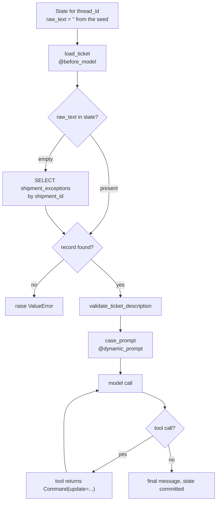

# 03 — Agent loop

**The question this answers:** how is the agent assembled, and what runs when it
is invoked?

"Called" is the important word: nothing in the app invokes this today (see page 02).
Everything below is assembled and ready, and the only missing piece is the
invocation itself.

## The assembly

`create_agent` is called once at startup with five decisions baked in
(`workflow/agent.py:59-68`):

| Argument | Value | Effect |
|---|---|---|
| `model` | `ChatOpenRouter` | the LLM; model id hardcoded in `llm/openrouter_service.py:6` |
| `tools` | 8 tools from 4 modules | what the model may call |
| `state_schema` | `TransitState` | the shape of the case, with merge rules |
| `middleware` | `[load_ticket, case_prompt]` | runs around every model call |
| `checkpointer` | `AsyncPostgresSaver` | state survives across calls, keyed by `thread_id` |

Because a checkpointer is attached, state is durable: the agent's memory of a
shipment lives in Postgres, not in the process. That is what makes
`thread_id = "shipment:{id}"` the identity of a case.

## What runs, in order, when invoked



## How to read it

**`load_ticket` is the hydration step.** It runs before every model call. Its
first check is `if state.get("raw_text")` — because the seed wrote an empty string,
that check is false on the first run, so it goes to the database and fills in
origin, destination, carrier and the real `raw_text`. On later runs for the same
`thread_id`, the checkpointer has restored real state, `raw_text` is present, and
the database is skipped entirely. That early-exit is the whole reason the
middleware exists.

**It also refuses to work on junk.** `validate_ticket_description` rejects
descriptions shorter than 5 characters, and rejects this exact set outright:

```
bad · n/a · none · null · error · unknown · test
```

A rejected description raises `ValueError`, which aborts the run. This is a guard
against the agent confidently analysing a placeholder — a real failure mode when
exceptions arrive from upstream systems.

**`case_prompt` is `@dynamic_prompt`, so it re-renders every model call.** It
concatenates the system prompt with a JSON dump of the current case: identity,
status, the latest analysis, context and actions. This is why the case is *not*
repeated in the user message — the middleware injects it fresh each turn, so the
model always sees current state rather than a stale copy.

**Then the ordinary loop.** Model call → if it asked for a tool, run the tool, feed
the result back, call the model again → repeat until it answers without a tool.
With a checkpointer attached, the resulting state is committed to Postgres.

## The eight tools

Tools do not return values to the model and stop there — most return a
`Command(update={...})`, which writes directly into graph state. That is how an
analysis becomes durable state rather than a chat message.

| Tool | File | What it does |
|---|---|---|
| `analyze_case` | `tools/analysis.py` | records classification, severity, missing info; **creates** actions; appends to history |
| `reanalyze_case` | `tools/analysis.py` | same, but **creates no new actions** — for re-runs after new context |
| `get_analysis_history` | `tools/analysis.py` | returns past analysis runs |
| `get_case` | `tools/case.py` | returns the whole case from state |
| `update_case_status` | `tools/case.py` | sets status to a literal string |
| `get_actions` | `tools/actions.py` | returns current actions |
| `update_action` | `tools/actions.py` | updates one or more action ids; **auto-resolves** the case when all are done |
| `add_context` | `tools/context.py` | appends a timestamped context entry |

Two behaviours worth noticing. `analyze_case` only creates actions when
`not existing_history` — so a first analysis creates them and any later analysis
must go through `reanalyze_case` to avoid duplicating them. And `update_action`
promotes the case to `resolved` on its own the moment every action is `completed`
or `cancelled`.

**Status lifecycle:**

```
new ──> analyzed ──> action_required ──> resolved
                 └──> (in_progress / closed via update_case_status)
```

## State and its merge rules

`TransitState` extends `AgentState` with `total=False` — every field is optional.
Each field declares how new values combine with old ones (`workflow/state.py`):

| Reducer | Used by | Behaviour |
|---|---|---|
| `reduce_last` | identity, text, severity | new value wins, unless it is `None` |
| `reduce_status` | `status` | new wins; never drops back to empty |
| `reduce_actions` | `actions` | merges by `id` — updates in place, appends new |
| `reduce_context` | `context` | appends, dedupes on `(source, content, created_at)` |
| `reduce_history` | `analysis_history` | appends, dedupes on `(exception_type, created_at)` |

The dedupe keys are what keep re-runs from bloating state, and `reduce_actions`
merging by `id` is what lets a tool update one action without rewriting the list.

## Follow it in the code

| What | Where |
|---|---|
| Assembly, tool list, `case_prompt` | `workflow/agent.py` |
| Hydration + validation guard | `workflow/middleware.py` |
| State shape and reducers | `workflow/state.py` |
| Initial state factory | `workflow/state.py:89-115` |
| Tools | `workflow/tools/{analysis,case,actions,context}.py` |
| System prompt | `workflow/prompts/system.py` |
| Checkpointer setup | `api/app.py:22-24` |

## Gotchas

- **`from langchain.agents import create_agent`** — the framework layer, not a
  hand-written graph. Per `CLAUDE.md` that stays until V4.
- **Tool arguments come from the model**, so they are untrusted. `update_case_status`
  lowercases and strips but does not validate against a list of allowed statuses —
  the model can write any string into `status`.
- **`update_action` takes `action_id: list[str]`**, so the model must pass a list
  even for one action.
- **Nothing here has run in production yet.** The first time you wire up
  `ainvoke`, expect the hydration path, the validation guard, and the tool
  argument shapes to be exercised for the first time.