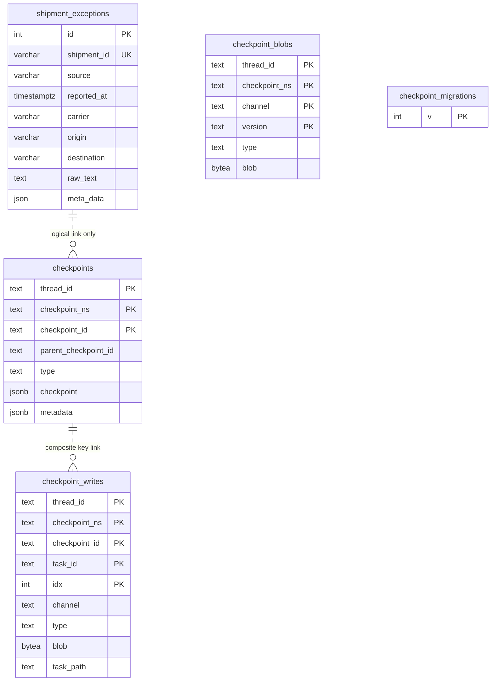

# 04 — Data model

**The question this answers:** what tables exist, and how are they connected?

Dashed relationship lines mean **non-identifying** — a link that exists in the
data but is not enforced by the database.



## How to read it

**Five tables, two owners.** `shipment_exceptions` belongs to TransitIQ — it is
defined in `database/models/exception_model.py` and created by
`Base.metadata.create_all` at startup. The other four belong to LangGraph's
checkpointer; they are created by `checkpointer.setup()` and their schema comes
from the library, not from this repo.

**The app table.** One row per reported exception. `shipment_id` is the natural
key and is both `unique` and indexed — that index is what makes the duplicate
check on insert fast, and what the `load_ticket` middleware queries against.
`meta_data` (note the underscore; the API field is `metadata`) is the only nullable
column. `source` is stored as free text but the API only ever writes one of
`email`, `edi`, `webhook`, `manual`.

**Composite keys everywhere in the checkpointer.** No checkpointer table has a
single-column primary key. `checkpoints` is keyed by
`(thread_id, checkpoint_ns, checkpoint_id)`, and `checkpoint_writes` by those three
plus `(task_id, idx)`. This is why the relationships in this model cannot be
drawn as ordinary foreign keys, and why the lines above are dashed.

**The link between the two worlds is a string convention, not a column.**

```
shipment_exceptions.shipment_id  =  'SHP-123'
checkpoints.thread_id            =  'shipment:SHP-123'
                                    └─ prefix added by workflow/config.py:3
```

Same shipment, different values. There is no column holding `'SHP-123'` in any
checkpointer table, so the two sides are not directly joinable — you must
reconstruct the `thread_id` to look up agent state for a shipment.

## There are zero FOREIGN KEY constraints

This is the single most important thing about this schema, and the reason the
relationships are dashed. LangGraph declares no foreign keys, so:

- **No referential integrity.** Nothing stops a checkpoint row referencing a
  shipment that does not exist.
- **No cascades.** Deleting a row from `shipment_exceptions` leaves every
  checkpoint row for that thread sitting in the database. Cleaning up a shipment
  means deleting from all three checkpointer tables yourself.
- **The `checkpoints` → `checkpoint_writes` link is composite in reality.**
  It joins on `(thread_id, checkpoint_ns, checkpoint_id)`, not on `checkpoint_id`
  alone — that column is not unique on its own.
- **`checkpoint_blobs` cannot be linked at all** in this notation. It has no
  `checkpoint_id` column; it is scoped by `(thread_id, checkpoint_ns, channel,
  version)` and related to a checkpoint only conceptually.

## Indexes

| Index | Table | Why |
|---|---|---|
| `ix_shipment_exceptions_shipment_id` (unique) | `shipment_exceptions` | duplicate check + middleware lookup |
| `ix_shipment_exceptions_id` | `shipment_exceptions` | primary key |
| `checkpoints_thread_id_idx` | `checkpoints` | fetching a thread's history |
| `checkpoint_blobs_thread_id_idx` | `checkpoint_blobs` | same |
| `checkpoint_writes_thread_id_idx` | `checkpoint_writes` | same |

All three checkpointer indexes are on `thread_id` alone — consistent with
`thread_id` being the access path for everything the checkpointer does.

## Follow it in the code

| What | Where |
|---|---|
| The app table | `database/models/exception_model.py` |
| Engine, session, DSN helper | `database/db.py` |
| Table creation at startup | `api/app.py:20-21` |
| Checkpointer migration DDL | `.venv/.../langgraph/checkpoint/postgres/base.py` (`MIGRATIONS`) |
| `thread_id` format | `workflow/config.py:3` |

## Gotchas

- **`checkpoint_ns` defaults to empty string**, so agent state is written into the
  default namespace. It is part of the primary key but never set explicitly here.
- **`blob` in `checkpoint_blobs` is nullable**, but `blob` in `checkpoint_writes`
  is `NOT NULL`. That asymmetry comes from a migration that dropped the constraint
  on the former.
- **`task_path` is `NOT NULL DEFAULT ''`** — added later by a migration, so older
  rows carry the empty string rather than `NULL`.
- **The API field is `metadata` but the column is `meta_data`.** Python's
  `metadata` name is taken on SQLAlchemy models, hence the rename. The mapping
  happens in `api/routers/exception_routes.py:62` and `:105`.
- **Postgres `JSON`, not `JSONB`, for `meta_data`** — SQLAlchemy's `JSON` type maps
  to `json`, which does not support the indexing or containment operators `jsonb`
  does. The checkpointer's own columns do use `jsonb`.