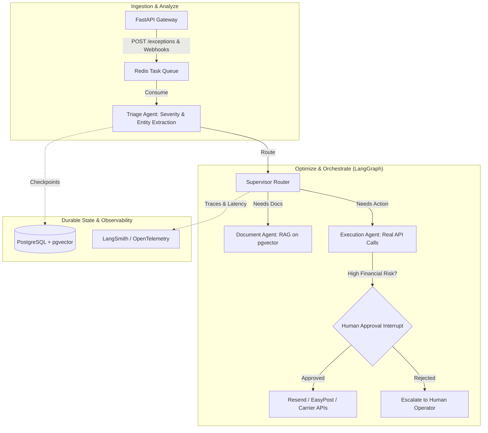

# TransitIQ: Project Roadmap & Architecture

## 🎯 Project Vision & Business Impact
**TransitIQ** is an AI-powered **Supply Chain Exception Management & Control Tower** platform. Inspired by enterprise leaders like project44 and FourKites, it moves beyond simple tracking to provide **autonomous exception resolution**. 

TransitIQ ingests unstructured logistics data, triages financial and operational risks (e.g., Demurrage & Detention), and executes real-world resolutions with strict Human-in-the-Loop (HITL) safeguards. Under the hood, every version runs on the **LangGraph execution engine** — for durable checkpointing and state persistence — but the *authoring layer* changes as complexity grows: LangChain's `create_agent` + middleware for the single-agent phases (V1–V3), stepping down to raw LangGraph `StateGraph` only once true multi-agent routing is needed (V4+).

**Target Outcome:** A senior-level portfolio centerpiece that demonstrates advanced agentic patterns, production readiness, and a deep understanding of enterprise business value.

> ⚠️ **Scope & Prioritization Note:** V4 and V5 are each realistically multi-week efforts on their own (multi-agent RAG; background workers + webhooks + CI/CD + load testing). If time is constrained, **V3 with a genuinely solid, demo-ready HITL flow is a stronger finished story than V5 half-built.** Treat V4/V5 as stretch goals, not requirements.

> 🧩 **Framework Choice Note:** Since LangChain and LangGraph's joint 1.0 release (Oct 2025), LangChain's `create_agent` runs *on* the LangGraph engine — they are not competing choices. Use `create_agent` + middleware (LangChain's built-in hook system for tool calls, guardrails, and HITL approval) for as long as the workflow is a single agent with tools. Only drop to a hand-written `StateGraph` when you need explicit multi-node branching/routing — that's V4, with the Supervisor pattern. **Deep Agents (virtual filesystem, subagent-spawning, auto context compression) is explicitly out of scope for this project** — it's built for open-ended, long-horizon planning tasks (e.g., coding agents), not TransitIQ's bounded, mostly-deterministic exception-resolution flow. Don't pull it in "just in case."

---

## ️ High-Level Architecture: Analyze -> Optimize -> Orchestrate

*Note: this diagram shows the **end-state (V4+)** architecture, including the Supervisor/multi-agent split and its raw `StateGraph`. In V1–V3, this is a single `create_agent` (with middleware) — no Supervisor, no separate DocAgent/ExecAgent nodes. Those only appear once V4 moves to a hand-written `StateGraph`.*



---

## ️ The 5-Version Roadmap

###  V1: The Stable Foundation
**Theme:** *Reliability, Clean Code, and Durable State Persistence.*
*   **Business Value:** Proves the system can reliably ingest, store, and track an exception without data loss.
*   **Key Features:**
    *   `POST /exceptions` endpoint with strict Pydantic validation.
    *   `GET /exceptions` read endpoint — newest reported first, capped at 50.
    *   React intake console in `frontend/` — a form to record an exception and a read-only ledger of what's on file. Served by FastAPI's StaticFiles in production, proxied to it in dev.
    *   Immutable `issues` table in PostgreSQL.
    *   Single agent via LangChain's `create_agent` (runs on the LangGraph engine — `AsyncPostgresSaver` checkpointing, thread_id = `shipment:{id}`, with zero hand-written graph code).
    *   Core tools: `analyze_case`, `add_context`, `update_action`.
    *   Interactive CLI for testing the agent loop.
*   **Tech Stack:** Python 3.13, FastAPI, `uv`, SQLAlchemy (async, `psycopg 3` driver), `langchain` (`create_agent`).
*   **Definition of Done:** A new developer can run `docker-compose up`, hit the API, and see the agent successfully analyze a mock delay and save the state to Postgres.

### 🟡 V2: Contextual Intelligence & Observability (The "Analyze" Phase)
**Theme:** *Making the Agent Smart, Structured, and Debuggable.*
*   **Business Value:** Transforms the agent from a "dumb router" to an "insightful assistant" that outputs enterprise-ready structured data.
*   **Key Features:**
    *   **Structured Output:** Agent outputs strictly typed Pydantic models (e.g., `ExceptionAnalysis` with `severity`, `root_cause`, `financial_risk`).
    *   **Observability:** Integrate **LangSmith** to trace every tool call, token usage, and latency metric.
    *   **Severity Scoring:** Auto-flag cases with keywords like "customs hold", "perishable", or "reefer failure" as `CRITICAL`.
*   **Tech Stack Additions:** `langsmith`, Pydantic V2 `with_structured_output`.
*   **Definition of Done:** The agent correctly identifies a high-risk pharmaceutical delay, outputs a strict JSON analysis, and the entire trace is visible in LangSmith.

### 🟠 V3: Real Actions & Human-in-the-Loop (The "Orchestrate" Phase)
**Theme:** *Enterprise Safety, Real-World Connectivity, and Idempotency.*
*   **Business Value:** Ensures AI can interact with the real world (emails, tracking) without causing financial damage through duplicate or rogue actions.
*   **Key Features:**
    *   **Real Integrations:** Connect **Resend** (for broker emails) and **EasyPost** (for live tracking).
    *   **Idempotency Guardrails:** All execution tools use idempotency keys (e.g., `broker_email_{shipment_id}`) to prevent duplicate API calls if the LLM loops.
    *   **HITL Middleware:** Use `create_agent`'s built-in human-in-the-loop middleware to pause execution when `severity == "CRITICAL"` — no hand-written `interrupt`/graph node needed.
    *   **Approval Endpoints:** `POST /exceptions/{id}/approve` to resume the agent.
    *   **Minimal Approval UI:** A simple read-only page/dashboard (even a single HTML page or Streamlit app) showing pending exceptions and an approve/reject button — this is what actually sells the "Control Tower" pitch in a demo, not just curl calls against the API.
    *   **Fallback / Mock Mode:** A toggle (env var) to run Resend/EasyPost calls against a mock/sandbox instead of the live API, so demos don't break on expired keys, rate limits, or network flakiness.
    *   **Retry & Dead-Letter Handling:** If an execution tool call fails after approval (e.g., Resend times out), retry with backoff a fixed number of times, then move the case to a `failed_actions` table/queue for manual follow-up instead of silently dropping it.
*   **Tech Stack Additions:** `httpx`, Resend API, EasyPost API, LangChain HITL middleware.
*   **Definition of Done:** A critical case is submitted, the agent halts at the "Draft Resolution" node, the user approves it via the UI, and a real email is sent via Resend — with a visible retry/failure path if the send fails.

### 🔴 V4: Multi-Agent Orchestration & RAG (The "Optimize" Phase)
**Theme:** *Scaling Complexity and Specialized Knowledge.*
*   **Business Value:** Handles complex, multi-step resolutions that require specialized knowledge (e.g., checking customs policies) and interaction with external systems.
*   **Key Features:**
    *   **Framework Step-Down:** This is the version where the project moves off `create_agent` and onto a hand-written LangGraph `StateGraph` — the single-agent abstraction can't express explicit multi-node routing cleanly. (Not Deep Agents — see the Framework Choice Note above.)
    *   **Supervisor/Router Pattern:** Split the monolithic agent into:
        1.  `TriageAgent`: Extracts entities, assesses financial risk.
        2.  `DocumentAgent (RAG)`: Queries `pgvector` for carrier customs policies and historical resolutions.
        3.  `ExecutionAgent`: Synthesizes findings and executes real-world tools.
    *   **Vector Database:** Integrate `pgvector` to store and query unstructured PDF customs documents and carrier SLAs.
*   **Tech Stack Additions:** LangGraph `StateGraph` (raw), `langchain-postgres` (pgvector), Unstructured.io or LlamaParse (for PDF parsing).
*   **Definition of Done:** A complex ticket triggers a multi-agent handoff. The Document Agent queries a vector DB to find the exact missing customs form, and the Execution Agent drafts the resolution.

### 🟣 V5: Production Scale & Autonomous Operations (The Masterpiece)
**Theme:** *Proactive, Self-Healing Supply Chain & Enterprise Ops.*
*   **Business Value:** Shifts the system from reactive exception management to predictive resolution, with production-grade reliability.
*   **Key Features:**
    *   **Background Processing:** Move agent execution off the main API thread using **Redis + ARQ/Celery**, returning `202 Accepted` immediately.
    *   **Webhook Ingestion:** Add endpoints to receive real-time push updates from carriers (e.g., EasyPost webhooks) to trigger the graph automatically.
    *   **Production Ops:** 
        *   Prometheus `/metrics` endpoint (request latency, agent success rate, dead-letter queue depth).
        *   Comprehensive CI/CD GitHub Actions (Lint, Type Check, Test, Build Docker).
        *   Load testing script (e.g., `locust`) to prove API resilience.
    *   **Control Tower Dashboard v2:** Extend the V3 approval UI into a real-time view (live status, retry/failure queue, success-rate trend) — this is the "visibility" layer that makes the control-tower pitch credible end-to-end, not just at the API/backend level.
*   **Tech Stack Additions:** Redis, ARQ, Prometheus, GitHub Actions, Locust.
*   **Definition of Done:** The project has a green CI/CD badge, a `/metrics` endpoint, and can autonomously resolve a pre-approved, low-severity exception end-to-end via background workers.

---

## 🛠️ Technology Stack Evolution

| Component | V1 - V2 | V3 - V4 | V5 |
| :--- | :--- | :--- | :--- |
| **Runtime** | Python 3.13+, `uv` | Python 3.13+, `uv` | Python 3.13+, `uv` |
| **API Framework** | FastAPI, Uvicorn | FastAPI + Structured JSON | FastAPI + Webhooks + Prometheus |
| **Frontend** | React 19 + Vite + TypeScript | React + Vite | React + Vite (control-tower dashboard) |
| **Orchestration** | `create_agent` on LangGraph (Single Agent) | `create_agent` + HITL middleware (V3) → raw `StateGraph` (V4, multi-agent RAG) | `StateGraph` (Multi-Agent + Background) |
| **Database** | PostgreSQL (psycopg 3) | PostgreSQL + `pgvector` | PostgreSQL + `pgvector` + Redis |
| **Observability** | Standard Logging | LangSmith Tracing | LangSmith + Prometheus/Grafana |
| **DevOps** | Local `.env`, basic Docker | Docker Compose (App + DB) | Docker Compose + GitHub Actions CI/CD |

---

##  Target Project Structure (V5)

```text
TransitIQ/
├── .github/
│   └── workflows/
│       ├── ci.yml               # Lint, type-check, test
│       └── build.yml            # Docker build and push
├── frontend/                    # React intake console
│   ├── src/
│   └── vite.config.ts
├── src/transitiq/
│   ├── api/
│   │   ├── app.py               # FastAPI app, routers, lifespan
│   │   ├── streaming.py         # SSE / WebSocket endpoints
│   │   └── run.py               # Uvicorn launcher
│   ├── core/
│   │   ├── config.py            # Pydantic-settings
│   │   ├── logging.py           # Structured logging setup
│   │   └── metrics.py           # Prometheus metrics
│   ├── database/
│   │   ├── db.py                # Async connection pool
│   │   ├── models.py            # SQLAlchemy / SQLModel definitions
│   │   └── repositories.py      # Data access layer
│   ├── agents/
│   │   ├── supervisor.py        # Multi-agent router
│   │   ├── triage.py            # Triage agent graph
│   │   ├── research.py          # RAG agent graph
│   │   └── resolution.py        # Resolution agent graph
│   ├── tools/
│   │   ├── rag_tools.py         # pgvector query tools
│   │   ├── external_tools.py    # Mock carrier API, email tools
│   │   └── state_tools.py       # update_action, add_context
│   ├── services/
│   │   ├── ticket_service.py    # Ingestion & checkpoint init
│   │   └── task_queue.py        # ARQ / Celery worker definitions
│   └── main.py                  # Advanced CLI with rich output
├── tests/
│   ├── conftest.py              # Pytest fixtures, mock DB
│   ├── test_api_contracts.py
│   ├── test_agent_workflows.py  # Deterministic LangGraph tests
│   └── test_rag.py
├── docker-compose.yml
├── Dockerfile
── locustfile.py                # Load testing
── pyproject.toml
└── uv.lock
```

---

## 💼 Interview Strategy: How to Sell This

When asked about this project in a 6-figure interview, use this framing:

> *"I studied enterprise control towers like project44 and realized their core value isn't just tracking—it's **autonomous exception resolution**. I built TransitIQ to replicate their 'Analyze-Optimize-Orchestrate' architecture on LangChain and LangGraph.
>
> I deliberately matched the framework layer to the actual complexity at each stage instead of over-engineering from day one: I started with LangChain's `create_agent` and its built-in HITL middleware for the single-agent phases — which still gets durable checkpointing for free, since `create_agent` runs on the LangGraph engine underneath — and only stepped down to a hand-written LangGraph `StateGraph` once I needed explicit multi-agent routing between a Triage, Document/RAG, and Execution agent. That progression is itself a demonstration of judgment: knowing when the simple abstraction is enough, and when it isn't. I also solved the LLM reliability problem with strict Pydantic structured outputs and idempotency keys on every real-world API call. It's not just a chatbot; it's a stateful, production-ready agentic workflow."*